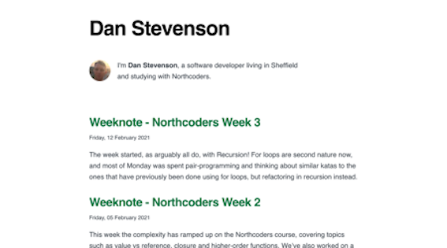
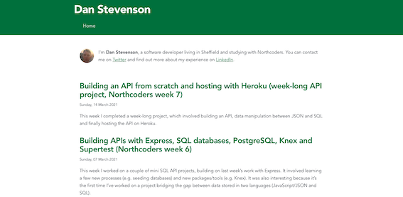
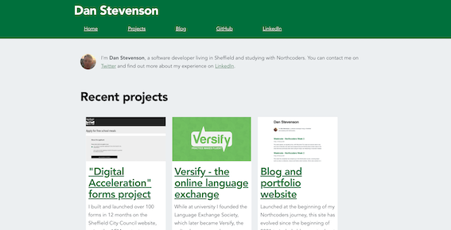

**Tech:** Gatsby JAM stack; JavaScript, GraphQL, NPM, React, CSS, HTML, Markdown <br/>
**Hosting**: Netlify auto-deploy from GitHub repo <br/>
**Most recent new feature**: Modify directory structure for `/blog` and `/projects` markdown files<br/>
**Git repo**: <a href="https://github.com/DanStevensonCO/DanStevensonCO" target="_blank">github.com/DanStevensonCO/DanStevensonCO</a>


>Launched at the beginning of my Northcoders journey, this site has evolved since the beginning of 2021 to include blog posts about my experience with Northcoders and past projects. Built using Gatsby, version-controlled with GitHub and hosted with Netlify, it's a project to give me a place to talk about my projects!



I've worked on a few content management systems in the past (using WordPress, Magento, Adobe Experience Manager) and know that getting them to behave and look as you want can be a challenge! 

So when planning to launch a new site in early 2021, I was looking for something much more customisable, while still being practical to manage. Gatsby seemed like an ideal tool for the job, and since my Northcoders software course focusses a lot on JavaScript, using the Gatsby JAM stack is a great way for me to build on that.

Gatsby is fully open-source, and you're able to take the base code and start building whatever you need on top of it. There are also "Gatsby starters", which give you templates you can use as a head-start. A bit like WordPress themes, these starters come in different shapes and sizes, from bare bones ones to very technically and visually complex ones. 

Since I didn't have any prior experience of building something with Gatbsy from scratch, but also didn't want to rely on someone else's design or architecture, I decided to use the most basic starter, the "<a href="https://www.gatsbyjs.com/starters/gatsbyjs/gatsby-starter-blog" target="_blank">gatsby-starter-blog</a>". 

It reminds me a bit of the <a href="https://en-gb.wordpress.org/themes/twentysixteen/" target="_blank">Twenty Sixteen WordPress theme</a> in that it's very minimalist, and could see that it would be a good, clean canvas for me to build on. 

After following the really simple installation and writing a couple of posts, I added the most minimal amount of styling (changing the `--primary-color` in the CSS), and was done for a v1.

<br/>



v2 wasn't a massive change visually to v1, but was laying the ground work for later changes. 

I added in a responsive navbar. Although it only contained one button when launched ("home" since there was nowhere else to go!), in development I'd added more elements and a CSS media query so that it would stack when the screen was below a certain width. The navbar also followed the `--primary-color` and gave the site a bit more colour and brightness. 

A lot of my posts so far have included code blocks, so I installed a plugin to allow for nice looking `in-line code` and:

```javascript
if (lines > 1){
    return multiLineCode
}
```

Since I'm going to be using the site to showcase some projects I've been working on, and I knew I'd be wanting some sort of grid to be able to display projects as blocks, I found the `global-wrapper` (basically the part that contains all of the site content in the middle) was a bit too narrow. Not probably an issue for most sites, where most people visit from a small mobile device, and which are rightly designed with from a "mobile first" perspective. But as a portfolio site, I need to consider larger screens as well. 



The third version of the site has seen the biggest number changes. 

Firstly, I've changed the background colour to a light grey. This is partly to distinguish from blocks with a white background, like the project blocks. It's also because I've heard that light grey backgrounds are easier for people to look at than a white background, which can cause issues for some people and be a bit too bright (I actually heard this at a talk from a lead developer at NHS Digital, and in honour of that, I stole one of the <a href="https://digital.nhs.uk/about-nhs-digital/corporate-information-and-documents/nhs-digital-style-guidelines/how-we-look/colour-palette" target="_blank">grey colours they use</a>).

The biggest change was adding the project block to the homepage. This is a `div` with three `div`s inside it, each of which have an image, header text and description about a recent project I've worked on. 

Amongst other things, this website is a place for me to be able to show the projects that I'm working on, so it's important that these things are prominent for visitors. 

I'm pretty happy with the way it looks currently. The white space is distinct from the new grey background, there's a thicker boarder around each project block when the user hovers over it, with the intention of maintaining the users interest on that block, and the descriptions hopefully include just enough information to make the user want to know more. 

Since it's also fairly wide, I've made it responsive for mobile devices, where the blocks stack on top of each other.

In future I might add to this section, but I also do want to keep an element of minimalism to the site. 

>I've worked in central and local government for the last few years, and really appreciate the amount of work that goes into research and design there, to make sure digital products are accessible and easy to use. That aesthetic minimalism appeals to me. 

With the addition of a projects section to add to the posts feed on the homepage, I also decided to split these two domains out into their own pages. The homepage will contain a smaller number of latest projects and posts, whereas `/blog` and `/projects` will contain a full list of each. 

These two new pages are built in React, so have their own folder within `/pages` and their own `index.js` files. Since the blog posts and projects posts are going to be created from markdown, I had to rearrange the directory structure slightly:
- `/content/blog` has changed to `/content/markdown`
- blog posts live in `/content/markdown/blog` and project posts live in `/content/markdown/projects`
- the `gatsby-source-filesystem` within `gatsby-config.js` was changed to serve content from `/content/markdown`

Each blog post or project post then has it's own folder in the relevant place, and an `index.md` file within that.

Finally the navbar looks a bit more like a navbar, with links to these new pages, plus a couple of external links. 

## New features

I'll be adding new features regularly and will update this page when I do. 

Recently it's mainly been a case of building out the content. I guess new functionality mainly needs to follow the content requirements, so more content will lead to more functionality. 

I'm also planning to add a bit more (minimalist) flair, but will want to improve on my CSS skills on the way.